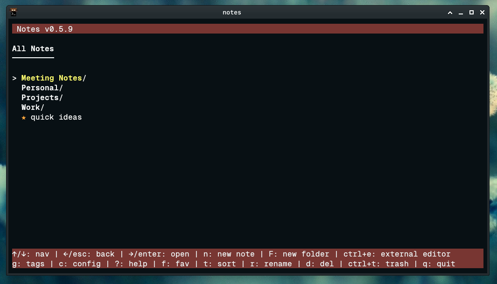
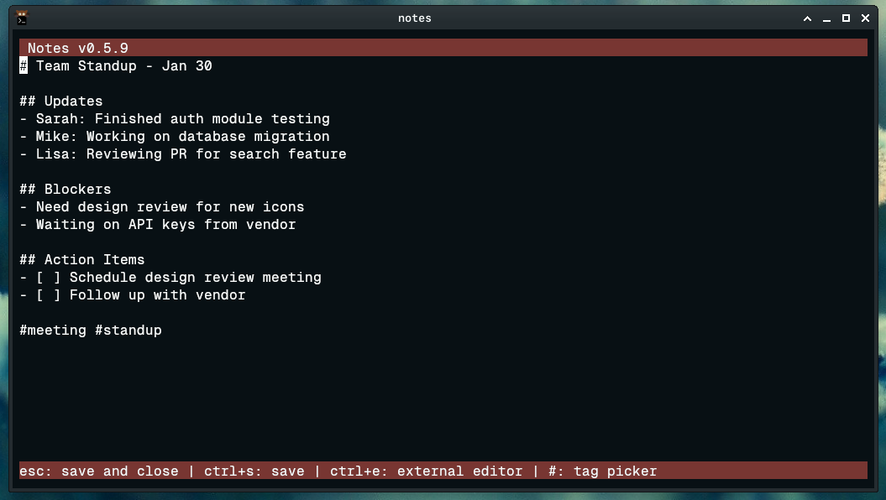
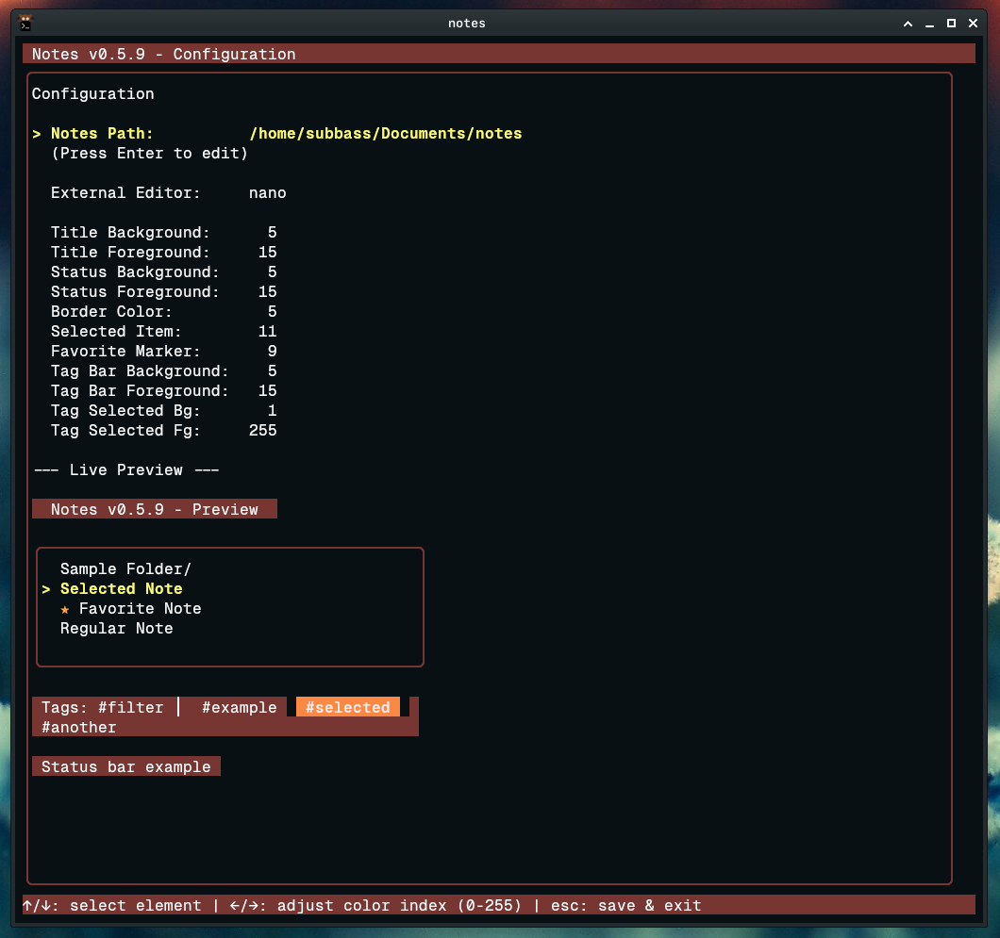

# Notes

A fast, simple terminal note-taking app. No databases, no sync services, no complexity - just plain markdown files in folders.

Built with Go and [Bubble Tea](https://github.com/charmbracelet/bubbletea).



## Philosophy

Notes keeps things simple:

- **Plain files** - Your notes are just `.md` files in directories. Use them with any other tool, back them up however you want, grep them from the command line.
- **No lock-in** - There's no proprietary format or database. Your notes folder works fine without this app.
- **Fast startup** - Opens instantly. No waiting for sync or database initialization.
- **Keyboard-driven** - Everything accessible without touching the mouse.

## Features

- Hierarchical folders for organization
- Inline tags (`#project`, `#urgent`, `#idea`)
- Tag browser to find notes by tag
- Favorites for quick access
- Trash with restore
- Built-in editor with Emacs-style keys
- External editor support (use vim, nano, whatever)
- Fully customizable colors (256-color palette)
- Cursor position remembered between sessions



## Installation

```bash
git clone https://github.com/yourusername/notes
cd notes
go build -o notes
./notes
```

Or just `go install` if you prefer.

## Quick Start

1. Run `./notes`
2. Press `n` to create your first note
3. Type your content (markdown supported)
4. Press `Esc` to save and close
5. Press `F` to create folders for organization

## Tags

Add tags anywhere in your notes using `#tagname`:

```markdown
# Meeting Notes

Discussed the new API design with the team.

#meeting #api #q1
```

Press `g` to open the tag browser and see all notes with a specific tag. When editing, type `#` to get a tag picker showing existing tags.

## Favorites

Press `f` on any note to mark it as a favorite. Favorites are shown with a `*` marker and can help you quickly find important notes.

## Keybindings

### Navigation

| Key | Action |
|-----|--------|
| `↑`/`↓` or `k`/`j` | Move selection |
| `Enter` or `→` | Open note/folder |
| `Esc` or `←` | Go back |
| `n` | New note |
| `F` | New folder |
| `f` | Toggle favorite |
| `r` | Rename |
| `d` | Delete (move to trash) |
| `t` | Toggle sort (name/date) |
| `g` | Tag browser |
| `c` | Configuration |
| `Ctrl+t` | View trash |
| `Ctrl+e` | Open in external editor |
| `?` | Help |
| `q` | Quit |

### Editor

| Key | Action |
|-----|--------|
| `Esc` | Save and close |
| `Ctrl+s` | Save |
| `Ctrl+e` | External editor |
| `#` | Tag picker |
| `Ctrl+h` | Editor help overlay |
| `Ctrl+a` / `Home` | Start of line |
| `Ctrl+e` / `End` | End of line |
| `Ctrl+u` | Delete to line start |
| `Ctrl+k` | Delete to line end |
| `Ctrl+w` | Delete word backward |
| `Ctrl+y` | Yank (paste killed text) |
| `Ctrl+←`/`→` | Jump by word |

## Configuration

Press `c` to open the configuration screen.



Options:
- **Notes path** - Where your notes live (default: `~/Documents/notes`)
- **External editor** - Command to run for `Ctrl+e` (default: `nano`)
- **Colors** - Customize every UI element with 256-color ANSI codes

The live preview shows your changes in real-time.

Config is stored at `~/.config/notes/config.json`.

## Storage

```
~/Documents/notes/          # Your notes (configurable)
├── Work/
│   ├── project-plan.md
│   └── meeting-notes.md
├── Personal/
│   └── ideas.md
├── quick-note.md
└── .trash/                 # Deleted items go here
```

Notes are plain markdown. Favorites have a `favorite: true` line at the top (hidden in the UI). That's it - no hidden metadata, no databases.

Cursor positions are saved separately at `~/.config/notes/cursor_positions.json` so you pick up where you left off.

## License

MIT
